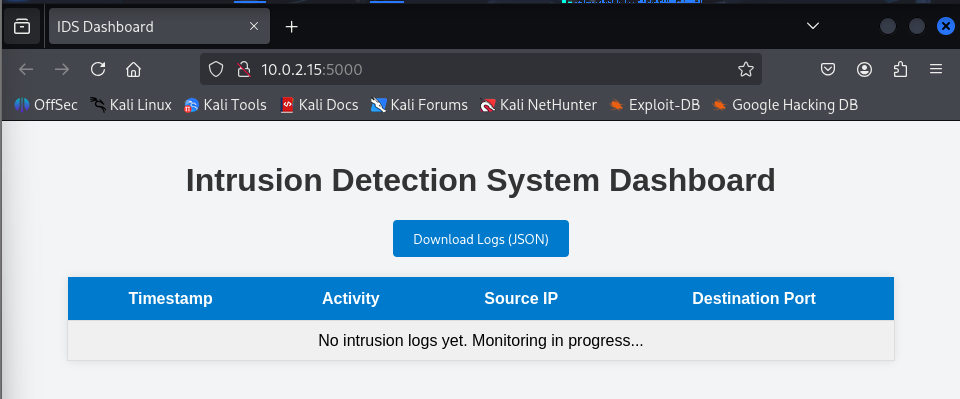
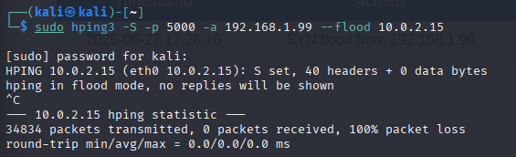
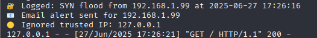
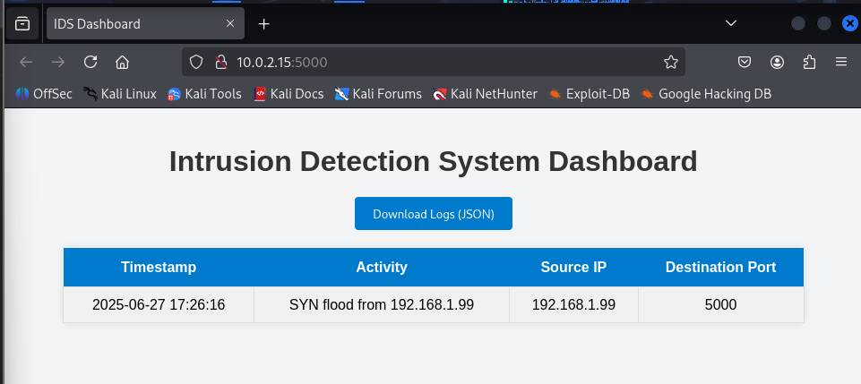
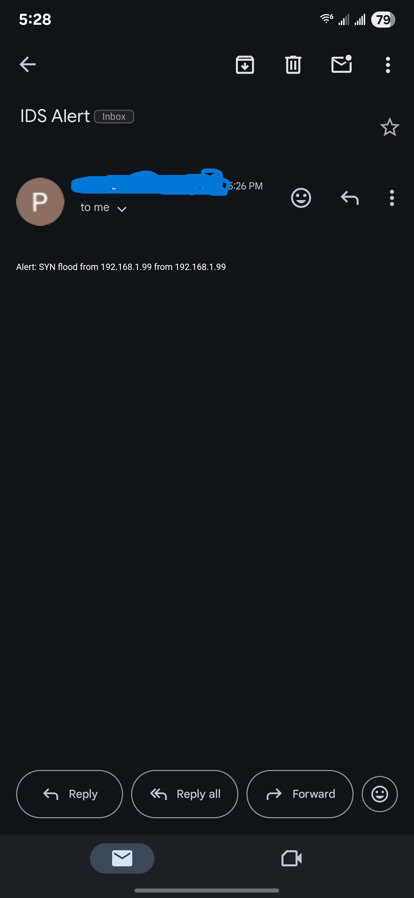

# 🔐 Intrusion Detection System (IDS)

This project implements a Python-based IDS that detects SYN flood attacks in real time. It logs detected events, sends email alerts, blocks attacker IPs via `iptables`, and displays everything on a Flask web dashboard.

## ⚙️ Features

- Real-time SYN‐flood detection using **Scapy**  
- Live attack logs via a **Flask** dashboard  
- Email alerts when an attack is detected  
- Automatic IP blocking with **iptables**  
- JSON log storage (`intrusion_log.json`)  
- Trusted IP whitelist (e.g. `127.0.0.1`)  

## 🛠️ Tech Stack

- **Python 3**  
- **Flask** (web framework)  
- **Scapy** (packet sniffing)  
- **iptables** (firewall rules)  
- **smtplib** (SMTP email alerts)  
- **JSON** (log persistence)  

## 🚀 How It Works

1. **Capture**: Scapy listens for TCP SYN packets on your chosen interface.  
2. **Detect**: If one source IP sends more than the configured SYN threshold in a short window:  
   - Append a log entry (timestamp, source IP, destination port) to `intrusion_log.json`  
   - Send an email alert to the configured recipient  
   - Block the source IP with an `iptables DROP` rule  
3. **Display**: A Flask app at `http://127.0.0.1:5000` shows all logged events and lets you download the JSON log.  

## 🛡️ Security Considerations

- Must run with **root** privileges (for raw sockets and firewall control)  
- Use **app‐specific SMTP passwords** for email alerts (Gmail, etc.)  
- Whitelist only trusted management IPs to avoid self‐blocking  
- Test in a **controlled environment** to prevent unintended network disruption  

## 📸 Screenshots

  <strong>🖥️ IDS Dashboard (No Logs)</strong> 
  

  <strong>🌊 SYN Flood Command</strong> 
  

  <strong>📟 Terminal Log Output</strong> 
  

  <strong>📊 IDS Dashboard (Attack Detected)</strong> 
  

  <strong>📧 Email Alert Notification</strong> 
  

